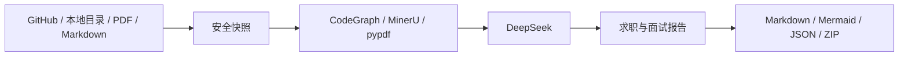

<div align="center">

<strong>简体中文</strong> · <a href="./README_EN.md">English</a>


<br />

      

**从项目证据到面试表达。**

[核心能力](#核心能力) · [安装](#安装) · [使用](#使用) · [报告](#报告产物) · [开发](#开发)

</div>

Repo2Career 分析 GitHub 仓库、本地项目目录、PDF 或 Markdown，还原业务流程、技术选型、架构与调用链，生成适合简历、STAR 讲述和技术面试的可追溯报告。

## 核心能力

| 环节 | 能力 |
| --- | --- |
| 输入 | GitHub 公有/私有仓库、本地目录、PDF、Markdown |
| 代码分析 | CodeGraph 调用链分析；不可用时确定性扫描降级 |
| PDF 解析 | MinerU 云解析；未配置 Key 时自动使用本地 pypdf |
| 推理 | DeepSeek 模型与 API 地址可配置，结论受证据约束 |
| 任务 | FastAPI 异步队列、SQLite 恢复、SSE 进度、取消与重试 |
| 交互 | React WebUI 与 Typer CLI 共用同一分析管线 |
| 溯源 | 报告引用联动原始 PDF 页块或 Markdown 行区间 |
| 输出 | 中英文 Markdown、Mermaid、证据 JSON、清单与 ZIP 报告包 |



## 平台支持

| 平台 | Shell | 状态 |
| --- | --- | --- |
| Linux | bash、zsh | 支持 |
| macOS | zsh、bash | 支持 Intel 与 Apple Silicon |
| Windows | PowerShell 7 | 支持 x64 与 ARM64 |

GitHub Actions 会在 Ubuntu、macOS 和 Windows 上执行后端检查、测试及前端生产构建。

## 安装

### 前置环境

- [uv](https://docs.astral.sh/uv/) 与 Python 3.12+
- [Node.js 22.13+ 或当前 LTS](https://nodejs.org/)
- CodeGraph，可选但推荐
- Archify，可选；未配置时输出 Mermaid

<details open>
<summary><strong>Linux / macOS</strong></summary>

```bash
curl -LsSf https://astral.sh/uv/install.sh | sh
cp .env.example .env

cd backend
uv sync --extra dev
uv run repo2career doctor
uv run repo2career serve
```

另开终端：

```bash
cd frontend
npm ci
npm run dev
```

</details>

<details>
<summary><strong>Windows PowerShell</strong></summary>

```powershell
powershell -ExecutionPolicy ByPass -c "irm https://astral.sh/uv/install.ps1 | iex"
Copy-Item '.env.example' '.env'

Set-Location 'backend'
uv sync --extra 'dev'
uv run repo2career doctor
uv run repo2career serve
```

另开终端：

```powershell
Set-Location 'frontend'
npm ci
npm run dev
```

</details>

WebUI：`http://localhost:5173`  
API 文档：`http://127.0.0.1:8000/docs`

## 配置

```dotenv
DEEPSEEK_API_KEY=your_deepseek_api_key
DEEPSEEK_MODEL=deepseek-v4-pro
MINERU_API_KEY=
GITHUB_TOKEN=
```

完整配置见 [.env.example](./.env.example)。WebUI 写入本机 `.env`，API 返回时自动隐藏敏感值。

## 使用

在 `backend` 目录执行：

```bash
uv run repo2career analyze github 'https://github.com/owner/repository'
uv run repo2career analyze folder '/path/to/project'
uv run repo2career analyze pdf '/path/to/project.pdf' --parser auto
uv run repo2career jobs
uv run repo2career report 'JOB_ID'
uv run repo2career doctor
```

Windows 路径可直接替换为 `D:\path\to\project`。

## 报告产物

固定 15 节报告覆盖：

1. 项目范围与一分钟介绍
2. 业务背景、角色与端到端流程
3. 功能模块、技术选型与系统架构
4. 调用链、数据流、接口与数据模型
5. 工程难点、质量属性与证据缺口
6. 简历要点、STAR 讲述与面试问题
7. 代码位置或 PDF 页码证据索引

```text
report/
├── report.md
├── evidence.json
├── manifest.json
├── report-bundle.zip
└── assets/
    ├── architecture.mmd
    └── architecture.ir.json
```

## 安全与隐私

- 不执行目标仓库代码，不运行其安装或构建脚本。
- 排除依赖目录、二进制、`.env` 和常见密钥文件。
- 仓库内的指令文本只作为证据，不作为系统指令执行。
- MinerU 模式会上传 PDF；pypdf 模式完全本地运行，但不提供 OCR。
- 显式使用 MinerU 时，远程失败不会静默切换解析器。

## 开发

```bash
cd backend
uv sync --extra dev --locked
uv run ruff check src tests
uv run pytest -q

cd ../frontend
npm ci
npm test
npm run build
```

规格位于 [`specs/`](./specs/)：

```text
specify -> plan -> tasks -> implement -> converge
```
