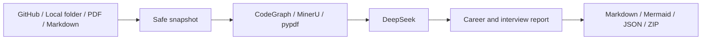

<div align="center">

<a href="./README.md">简体中文</a> · <strong>English</strong>


<br />

      

**From project evidence to an interview-ready narrative.**

[Features](#features) · [Install](#installation) · [Use](#usage) · [Reports](#report-bundle) · [Develop](#development)

</div>

Repo2Career analyzes GitHub repositories, local projects, PDFs, and Markdown documents to reconstruct business flows, technology choices, architecture, and call paths, then produces traceable material for resumes, STAR narratives, and technical interviews.

## Features

| Stage | Capability |
| --- | --- |
| Input | Public or private GitHub repositories, local folders, PDFs, and Markdown |
| Code | CodeGraph call-path analysis with deterministic scanning fallback |
| PDF | MinerU cloud parsing with automatic local pypdf fallback when no key is set |
| Reasoning | Configurable DeepSeek model and endpoint with evidence-constrained output |
| Jobs | Async FastAPI queue, SQLite recovery, SSE progress, cancellation, and retry |
| Clients | React WebUI and Typer CLI sharing one analysis pipeline |
| Traceability | Report citations linked to PDF page blocks or Markdown line ranges |
| Output | Chinese or English Markdown, Mermaid, evidence JSON, manifest, and ZIP bundle |



## Platform Support

| Platform | Shell | Status |
| --- | --- | --- |
| Linux | bash, zsh | Supported |
| macOS | zsh, bash | Intel and Apple Silicon |
| Windows | PowerShell 7 | x64 and ARM64 |

GitHub Actions verifies the backend, tests, and frontend production build on Ubuntu, macOS, and Windows.

## Installation

### Prerequisites

- [uv](https://docs.astral.sh/uv/) and Python 3.12+
- [Node.js 22.13+ or the current LTS](https://nodejs.org/)
- CodeGraph, optional but recommended
- Archify, optional; Mermaid remains available without it

<details open>
<summary><strong>Linux / macOS</strong></summary>

```bash
curl -LsSf https://astral.sh/uv/install.sh | sh
cp .env.example .env

cd backend
uv sync --extra dev
uv run repo2career doctor
uv run repo2career serve
```

In another terminal:

```bash
cd frontend
npm ci
npm run dev
```

</details>

<details>
<summary><strong>Windows PowerShell</strong></summary>

```powershell
powershell -ExecutionPolicy ByPass -c "irm https://astral.sh/uv/install.ps1 | iex"
Copy-Item '.env.example' '.env'

Set-Location 'backend'
uv sync --extra 'dev'
uv run repo2career doctor
uv run repo2career serve
```

In another terminal:

```powershell
Set-Location 'frontend'
npm ci
npm run dev
```

</details>

WebUI: `http://localhost:5173`  
API docs: `http://127.0.0.1:8000/docs`

## Configuration

```dotenv
DEEPSEEK_API_KEY=your_deepseek_api_key
DEEPSEEK_MODEL=deepseek-v4-pro
MINERU_API_KEY=
GITHUB_TOKEN=
```

See [.env.example](./.env.example) for every setting. The WebUI writes to the local `.env`, and API responses mask secrets.

## Usage

Run from `backend`:

```bash
uv run repo2career analyze github 'https://github.com/owner/repository'
uv run repo2career analyze folder '/path/to/project'
uv run repo2career analyze pdf '/path/to/project.pdf' --parser auto
uv run repo2career jobs
uv run repo2career report 'JOB_ID'
uv run repo2career doctor
```

On Windows, replace the source path with a native path such as `D:\path\to\project`.

## Report Bundle

The fixed 15-section report covers:

1. Scope and one-minute introduction
2. Business context, actors, and end-to-end flows
3. Features, technology rationale, and architecture
4. Call paths, data flows, APIs, and data models
5. Engineering challenges, quality attributes, and evidence gaps
6. Resume bullets, STAR narrative, and interview questions
7. Evidence index with code locations or PDF pages

```text
report/
├── report.md
├── evidence.json
├── manifest.json
├── report-bundle.zip
└── assets/
    ├── architecture.mmd
    └── architecture.ir.json
```

## Security and Privacy

- Target repository code, installers, and build scripts are never executed.
- Dependency directories, binaries, `.env`, and common secret files are excluded.
- Instructions found inside repositories remain evidence and are never treated as system instructions.
- MinerU uploads PDFs; pypdf runs locally but does not provide OCR.
- Explicit MinerU runs never fall back silently after a remote failure.

## Development

```bash
cd backend
uv sync --extra dev --locked
uv run ruff check src tests
uv run pytest -q

cd ../frontend
npm ci
npm test
npm run build
```

Specifications live in [`specs/`](./specs/):

```text
specify -> plan -> tasks -> implement -> converge
```
