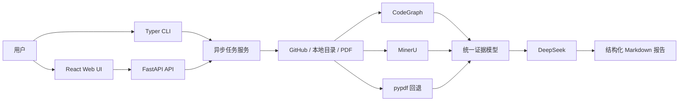

# Repo2Career 项目计划

## 1. 项目目标

Repo2Career 面向求职和技术面试场景，分析 GitHub 仓库、本地项目目录或 PDF 文档，整理出可核验的项目说明、业务流程、技术选型、系统架构、工程难点、简历描述、STAR 讲述稿和面试问题。

项目输出以结构化 Markdown 为主，同时保留架构图、证据数据和任务清单，方便复盘、分享和归档。

## 2. 产品范围

- GitHub 仓库：下载指定仓库和分支，记录 revision，进行静态扫描。
- 本地目录：通过 Web 或 CLI 提交目录快照，不执行目标项目代码。
- PDF 文档：优先使用 MinerU 云解析；未配置或远程失败时回退到 pypdf。
- 代码分析：优先使用 CodeGraph 获取调用路径，不可用时使用确定性扫描降级。
- 报告生成：使用 DeepSeek 进行受证据约束的内容整理。
- 交付方式：Web UI、CLI、Markdown、Mermaid 架构图和 ZIP 报告包。

## 3. 技术架构

### 技术选型

- 前端：React、Vite、TypeScript、Tailwind CSS、shadcn/ui 风格组件。
- 后端：FastAPI、Python、异步任务队列、Typer CLI。
- 配置：`.env` 文件与 `python-dotenv`，支持 Web UI 更新本机配置。
- 存储：按任务隔离的本地 `.data/jobs` 目录，保存输入快照、报告和证据。
- 大模型：DeepSeek，模型、Base URL 和推理强度可配置。
- PDF：MinerU v4 API；鉴权失败、网络失败或未配置时使用 pypdf。
- 图分析：CodeGraph；不可用时保留确定性扫描结果和降级提示。

## 4. 异步分析流程

1. 接收 GitHub URL、本地目录或 PDF，并创建任务记录。
2. 建立不可变输入快照，限制文件数量、大小和类型。
3. 代码任务扫描清单、入口和调用关系；PDF 任务提取页面文本。
4. 将扫描结果规范化为统一证据模型，保留文件、行号或页码。
5. 将有界证据发送给 DeepSeek，生成固定结构的报告内容。
6. 生成 Mermaid 架构图和报告包。
7. 校验报告文件、清单和 ZIP 包完整性。
8. Web UI 通过任务状态和事件流展示进度，并提供下载。

## 5. 面向用户的报告结构

正文只保留对求职和面试有帮助的内容，不展示内部分析元数据、置信度计算或证据索引章节：

1. 一分钟项目介绍
2. 业务背景、用户角色与核心价值
3. 完整端到端业务流程
4. 功能模块与用例
5. 技术栈及选型依据
6. 系统架构
7. 核心调用链、数据流、接口与数据模型
8. 关键工程难点、权衡和亮点
9. 安全、性能、可靠性与可维护性
10. 简历项目描述
11. STAR 项目讲述稿
12. 面试问题与追问

证据 JSON、manifest 和架构图仍会放在可下载的报告包中，但不干扰正文阅读。

## 6. Web UI 设计方向

- 默认中文，可切换英文。
- 支持亮色和暗色主题，并保存本机偏好。
- 使用暖纸色、细线、紧凑排版和单一信号色，避免渐变、发光和营销化 AI 视觉。
- 首页聚焦“新建分析”，提供 GitHub、本地目录和 PDF 三种入口。
- 固定底部工作台导航：新建分析、分析记录、本机配置。
- 历史任务标题需要截断，不能撑破侧边栏。
- 报告页采用目录 + 正文的阅读布局，移动端可滚动浏览。

## 7. 配置要求

主要配置写入项目根目录 `.env`：

- `DEEPSEEK_API_KEY`
- `DEEPSEEK_MODEL`
- `DEEPSEEK_BASE_URL`
- `MINERU_API_KEY`
- `MINERU_BASE_URL`
- `PDF_PARSER=auto`
- `GITHUB_TOKEN`
- `DATA_DIR`

MinerU Token 必须使用 API 管理页面创建的 API Token，不使用网页登录 JWT。MinerU 失败时报告中明确记录已回退到 pypdf；pypdf 不提供 OCR。

## 8. 验收标准

- Linux、macOS、Windows 均可启动后端、前端和 CLI。
- GitHub、本地目录、PDF 三类输入均能创建异步任务。
- CodeGraph 不可用时任务仍能完成，并显示降级状态。
- MinerU 未配置或鉴权/网络失败时，PDF 自动回退 pypdf。
- 报告正文不出现项目快照、风险/置信度、证据索引和模型元数据章节。
- 每个完成任务包含 Markdown、架构图、manifest、证据 JSON 和 ZIP 包。
- 页面在桌面、平板和移动端不发生横向溢出。
- 前后端测试、类型检查和生产构建全部通过。

## 9. 当前状态

- 平台基础、代码分析、PDF 分析、报告体验已实现。
- MinerU 401 鉴权提示和 pypdf 自动回退已实现。
- 报告模板已移除内部章节，旧报告在前端打开时也会兼容清洗。
- Cali 风格的暖纸色视觉、底部 dock、响应式布局已实现。
- 当前前端地址：`http://127.0.0.1:5173`
- 当前后端地址：`http://127.0.0.1:8000`
- 最近验证：后端 16 项测试通过，前端 2 项测试通过，生产构建通过。

## 10. 后续计划

- 增加 MinerU API Token 在线连通性测试。
- 增加报告正文的可复制引用和架构图预览。
- 增加任务删除、归档和报告重新生成操作。
- 增加 Playwright 浏览器级回归测试。
- 根据真实仓库样本继续校准 DeepSeek 报告提示词和章节质量。
